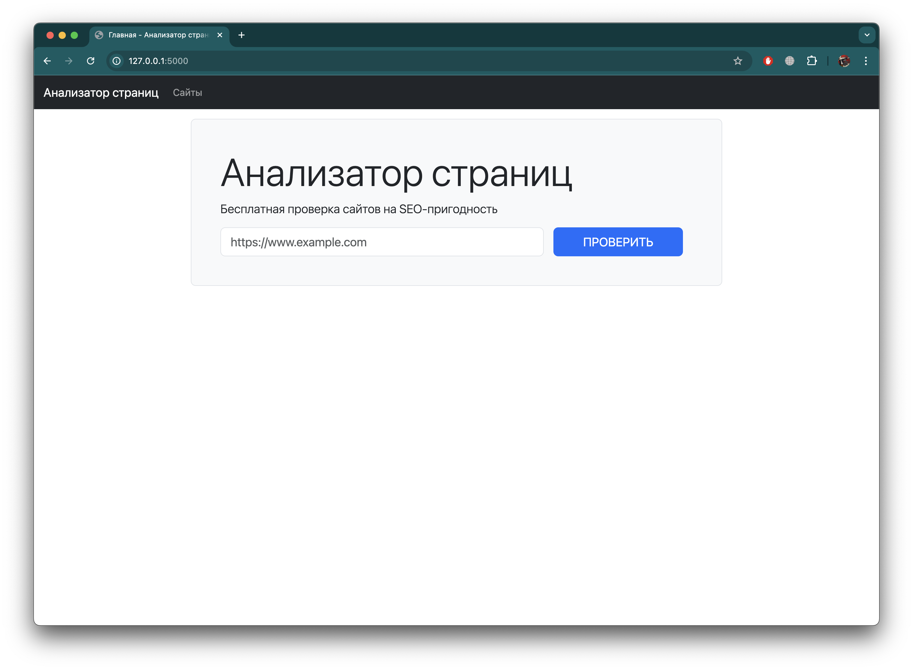
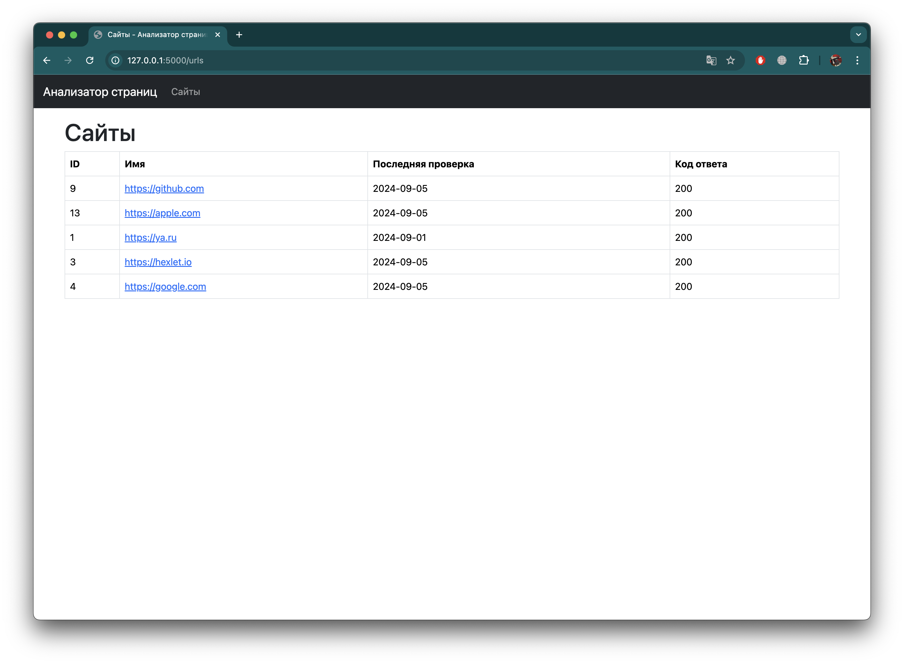
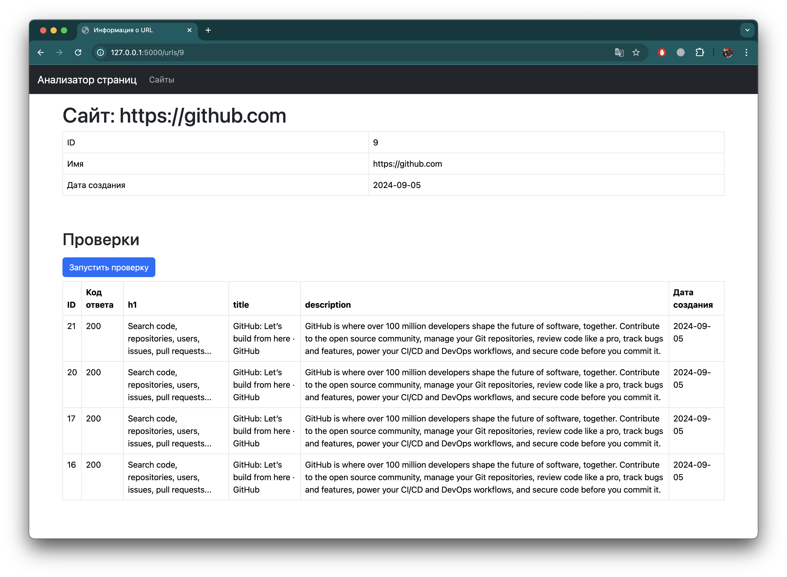
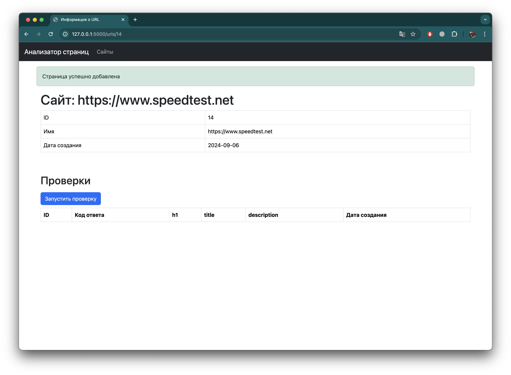

### Hexlet tests and linter status:
[](https://github.com/mishablokhin/python-project-83/actions)

### Ссылка на Render.com для просмотра проекта:
[Анализатор страниц](https://python-project-83-8pm5.onrender.com)

# Page Analyzer - Анализатор страниц

**Page Analyzer** — это полноценное веб-приложение на базе фреймворка Flask для анализа страниц на SEO-пригодность, аналогичное сервису PageSpeed Insights. В рамках проекта отрабатываются базовые принципы разработки сайтов с использованием MVC-архитектуры, роутинга, работы с базой данных и визуального оформления с помощью Bootstrap.

## Цель проекта

Цель проекта — изучение и применение базовых концепций веб-разработки бэкенда, включая:

- **Протокол HTTP и клиент-серверная архитектура**: каждый запрос к сайту — это HTTP-запрос, а результат — HTTP-ответ.
- **Роутинг**: связывание HTTP-запросов с соответствующими обработчиками на основе маршрутов.
- **Работа с базой данных**: проектирование структуры базы данных и выполнение SQL-запросов через библиотеку `psycopg2`.
- **Фронтенд**: использование фреймворка Bootstrap для создания красивого и удобного пользовательского интерфейса.
- **Инфраструктура и деплой**: разворачивание приложения в локальном окружении и деплой на платформу [Render.com](https://render.com).

## Установка
Перед началом работы с проектом необходимо создать базу данных PostgreSQL. Для создания необходимых для работы таблиц можно использовать SQL-запросы из файла *database.sql*. Также необходимо в корневой директории проекта создать файл *.env* и поместить в него переменные окружения: 

**SECRET_KEY** - секретный ключ для работы механизма сессий в Flask.

**DATABASE_URL** - ссылка для подключения к базе данных в формате postgresql://

Для установки зависимостей и настройки окружения используется [Poetry](https://python-poetry.org/). Выполните следующие команды для установки и запуска приложения:

1. Клонируйте репозиторий и перейдите в загруженную директорию:

```bash
git clone <репозиторий>
cd <папка с проектом>
```
2. Установите зависимости через `Poetry`:
```bash
make install
```

3. Выполните запуск проекта, используя `Gunicorn` (при необходимости можно изменить порт запуска в *Makefile*):
```bash
make start
```

## Работа с приложением
После выполнения запуска приложения, перейдите по локальному IP-адресу, указанному в терминале.

- На главной странице нужно ввести URL-адрес сайта, который добавляется в базу данные, если был введёный адрес прошёл валидацию.

- Список всех добавленных адресов можно увидеть на вкладке "Сайты". Напротив каждого сайта отображается код ответа сервера 200, если страница открывается. Также можно увидеть дату выполнения последней проверки.

- Для каждого добавленного сайта предоставляется отдельная страница, на которой можно запустить проверку и увидеть результаты анализа, такие как наличие заголовков h1, метатегов title и description.

- Результаты выполнения всех операций, а также сообщения об ошибках отображаются в верхней части страницы через flash-сообщения.

## Скриншоты




